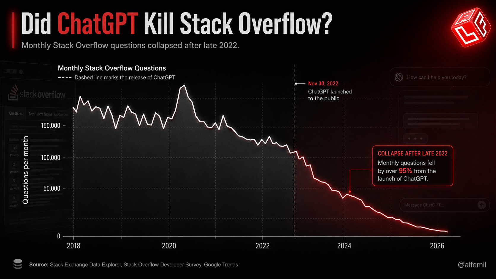
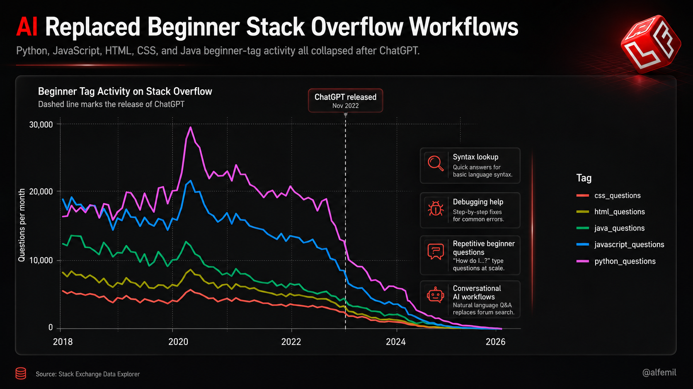

# Did ChatGPT Kill Stack Overflow?

<p align="center">
  
</p>

<p align="center">
<b>Programmers did not stop asking questions. They started asking machines.</b>
</p>

---

## Overview

This repository contains a lightweight independent data analysis exploring whether the rise of conversational AI systems such as ChatGPT coincided with declining public activity on Stack Overflow.

The project combines:

- Stack Overflow activity data
- Stack Overflow Developer Survey statistics
- Google Trends attention data
- Statistical visualization in R
- Editorial infographic design
- A custom LaTeX research article workflow

The goal is not to prove direct causality, but to examine whether multiple public signals changed during the same period that AI-assisted programming tools became mainstream.

---

# Key Findings

## 1. Stack Overflow question activity collapsed after late 2022

Public monthly question volume declined sharply after the public release of ChatGPT.

<p align="center">
  
</p>

---

## 2. Beginner-oriented programming tags declined together

Python, JavaScript, HTML, CSS, and Java beginner-tag activity all show strong simultaneous declines after late 2022.

<p align="center">
  
</p>

---

## 3. AI tool adoption among developers increased rapidly

According to Stack Overflow Developer Surveys, AI-assisted development adoption rose significantly between 2023 and 2025.

---

# Repository Structure

```text
did-chatgpt-kill-stackoverflow/
│
├── data/
│   └── raw/
│       ├── google_trends_chatgpt.csv
│       ├── stackoverflow_ai_survey_summary.csv
│       ├── stackoverflow_beginner_tags_monthly.csv
│       ├── stackoverflow_question_metrics_monthly.csv
│       └── stackoverflow_questions_monthly.csv
│
├── figures/
│   └── raw/
│       ├── figure_01_questions_per_month.png
│       ├── figure_02_before_after_questions.png
│       ├── figure_03_beginner_tags.png
│       ├── figure_04_ai_adoption.png
│       └── figure_05_google_trends_chatgpt.png
│
├── graphic/
│   ├── figure_01_questions_per_month.png
│   ├── figure_02_before_after_questions.png
│   ├── figure_03_beginner_tags.png
│   └── image.png
│
├── R/
│   └── did_chatgpt_kill_stackoverflow.R
│
└── README.md
```

---

# Data Sources

## Stack Exchange Data Explorer

Primary Stack Overflow activity data was extracted from:

https://data.stackexchange.com/stackoverflow

### Monthly Stack Overflow Questions

```sql
SELECT
  YEAR(CreationDate) AS year,
  MONTH(CreationDate) AS month,
  COUNT(*) AS questions
FROM Posts
WHERE PostTypeId = 1
  AND CreationDate >= '2018-01-01'
GROUP BY YEAR(CreationDate), MONTH(CreationDate)
ORDER BY year, month;
```

---

### Monthly Stack Overflow Metrics

```sql
SELECT
  YEAR(CreationDate) AS year,
  MONTH(CreationDate) AS month,
  COUNT(*) AS questions,
  SUM(CASE WHEN AnswerCount = 0 THEN 1 ELSE 0 END) AS unanswered_questions,
  SUM(CASE WHEN AcceptedAnswerId IS NOT NULL THEN 1 ELSE 0 END) AS accepted_answer_questions,
  AVG(CAST(AnswerCount AS FLOAT)) AS avg_answers,
  AVG(CAST(CommentCount AS FLOAT)) AS avg_comments,
  AVG(CAST(Score AS FLOAT)) AS avg_score
FROM Posts
WHERE PostTypeId = 1
  AND CreationDate >= '2018-01-01'
GROUP BY YEAR(CreationDate), MONTH(CreationDate)
ORDER BY year, month;
```

---

### Beginner Tag Activity

```sql
SELECT
  YEAR(CreationDate) AS year,
  MONTH(CreationDate) AS month,
  SUM(CASE WHEN Tags LIKE '%<python>%' THEN 1 ELSE 0 END) AS python_questions,
  SUM(CASE WHEN Tags LIKE '%<javascript>%' THEN 1 ELSE 0 END) AS javascript_questions,
  SUM(CASE WHEN Tags LIKE '%<html>%' THEN 1 ELSE 0 END) AS html_questions,
  SUM(CASE WHEN Tags LIKE '%<css>%' THEN 1 ELSE 0 END) AS css_questions,
  SUM(CASE WHEN Tags LIKE '%<java>%' THEN 1 ELSE 0 END) AS java_questions
FROM Posts
WHERE PostTypeId = 1
  AND CreationDate >= '2018-01-01'
GROUP BY YEAR(CreationDate), MONTH(CreationDate)
ORDER BY year, month;
```

---

## Stack Overflow Developer Surveys

- 2023 Developer Survey
- 2024 Developer Survey
- 2025 Developer Survey

Used for AI adoption statistics.

---

## Google Trends

Google Trends was used as a supporting public attention signal for the term:

```text
ChatGPT
```

Google Trends measures relative search interest, not absolute search volume.

---

# Technical Workflow

The project was built using a lightweight reproducible workflow centered around R and LaTeX.

## Tools Used

- R
- tidyverse
- ggplot2
- dplyr
- readr
- LaTeX
- Stack Exchange Data Explorer
- Google Trends

## Workflow

```text
Data Collection
    ↓
Data Cleaning
    ↓
Statistical Analysis
    ↓
Visualization in R
    ↓
Editorial Infographic Design
    ↓
LaTeX Article Production
```

---

# Article

The full article is written in LaTeX using a custom research-style document class.

The article combines:
- technical analysis,
- editorial storytelling,
- statistical visualization,
- and infographic design.

---

# Notes

This project is exploratory and should not be interpreted as proof that ChatGPT directly caused Stack Overflow's decline.

The analysis instead investigates whether:
- public Stack Overflow activity,
- AI tool adoption,
- and public AI attention

shifted during the same historical period.

---

# Author

## Alf Emil

Data Science · Machine Learning · Independent Research

- YouTube: https://youtube.com/@alfemil
- GitHub: https://github.com/Alfemil99
- X: https://x.com/alfemil99
- Substack: https://alfemil.substack.com
